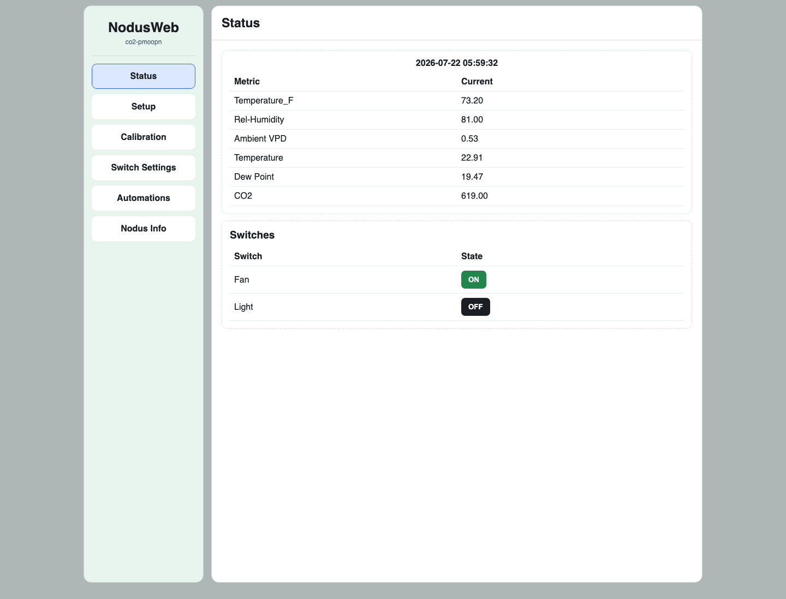

# cPyNodus_II

`cPyNodus_II` is pre-1.0 CircuitPython firmware for small Wi-Fi sensor and
relay devices. A Nodus can operate as a sensor, a switch, or a combined
sensor-and-switch node. It supports local setup through NodusWeb as well as
MQTT integrations with Sensorius, WeeWX, and Home Assistant.

Current firmware version: `v0.26.203.4`



## Project status

The firmware is under active development and is intended for hobbyist,
educational, and experimental IoT deployments. Configuration keys, MQTT
contracts, and internal architecture may change before version 1.0.

The supported boards and core runtime paths have been tested on physical
hardware. Host-side tests supplement, but do not replace, on-device validation.

## Supported hardware

| Target | Board | Verified CircuitPython |
| --- | --- | --- |
| `pico2w` | Raspberry Pi Pico 2 W | `9.2.8` |
| `xesp32s3` | Seeed Studio XIAO ESP32-S3 Sense | `10.2.1` |

The original RP2040 Raspberry Pi Pico W is not supported.

Nodus supports optional I2C environmental sensors, UART/Modbus soil sensors,
and up to two configured relay channels. See the [pinout guide](docs/pinout.md)
for the current board mappings.

## Features

- Sensor-only, switch-only, and combined sensor-plus-switch configurations
- First-boot hardware detection and TOML configuration generation
- Wi-Fi station startup with AP fallback for setup and network recovery
- Lightweight NodusWeb status, setup, calibration, switch, and automation pages
- MQTT telemetry, retained state, availability, configuration, and calibration
- Sensorius onboarding and device-management contracts
- WeeWX 5 integration and Nodus report skin
- Home Assistant MQTT discovery
- NodusWeb-local sensor, time, timer, and AND/OR switch automations
- Bounded recovery and reboot diagnostics on writable filesystems
- Target-specific compiled MPY firmware builds
- Signed OTA preparation, authenticated chunked HTTP transfer, verification,
  transactional apply, and rollback support

## Runtime profiles

| Profile | Purpose |
| --- | --- |
| `nodusweb` | Local web UI and API without an MQTT broker; supports local switch automations |
| `sensorius` | Headless MQTT operation managed by Sensorius |
| `weewx` | Headless MQTT publishing for the included WeeWX integration |
| `homeassistant` | Headless MQTT operation with Home Assistant discovery |

AP mode remains available for initial setup and network recovery. Normal
runtime web pages are intentionally disabled for the headless MQTT profiles.

## Quick start

1. Install the verified CircuitPython version for your board.
2. Clone this repository.
3. Build target-specific MPY firmware when using compiled deployment:

   ```bash
   scripts/nodus_mpy.sh --target pico2w
   # or
   scripts/nodus_mpy.sh --target xesp32s3
   ```

4. Deploy to the mounted `CIRCUITPY` drive:

   ```bash
   scripts/deploy_nodus.sh --target /Volumes/CIRCUITPY --content pico2w-mpy
   # or
   scripts/deploy_nodus.sh --target /Volumes/CIRCUITPY --content xesp32s3-mpy
   ```

   Preview a deployment without writing by adding `--dry-run`.

5. Reboot the device. On a clean deployment, Nodus creates the live TOML files
   required for the detected hardware.
6. For initial setup, connect to the configured Nodus AP and open
   `http://192.168.4.1:8000/setup`.

See the [user guide](docs/user_guide.md) for setup screens, Sensorius
onboarding, profile behavior, calibration, switches, and automations. See the
[technical reference](docs/README.md) for complete deployment options and
runtime details.

## Configuration and integration documentation

- [User guide](docs/user_guide.md)
- [Technical reference](docs/README.md)
- [Configuration files and keys](docs/configuration.md)
- [Architecture](docs/architecture.md)
- [Board pinouts](docs/pinout.md)
- [MQTT overview](docs/mqtt.md)
- [Sensorius contract](docs/sensorius_contract.md)
- [NodusWeb automations](docs/automations.md)
- [Over-the-air updates](docs/ota.md)
- [WeeWX integration](docs/weewx.md)
- [Extending sensors and switches](docs/extending.md)

## Security

Nodus is intended for trusted-network, hobbyist, and educational deployments.
Credentials written by onboarding are obfuscated rather than encrypted, and
the firmware is not hardened against physical access to the CircuitPython
filesystem. Review the [security policy](docs/SECURITY.md) before deployment
in any environment where credential or device access would be consequential.
OTA packages are authenticated with a device-held public key, but their
temporary HTTP transport is not confidential.

Report suspected vulnerabilities privately using the process in the security
policy rather than opening a public issue.

## Development and testing

Host-side verification uses Ruff and pytest:

```bash
ruff check .
pytest -q
```

These checks run under CPython and do not execute the firmware on a
CircuitPython board. Changes involving hardware, Wi-Fi, MQTT, recovery, OTA,
filesystem behavior, or relay operation require relevant on-device validation.
MQTT validation requires broker-visible evidence; serial output alone is not
proof that a publish reached the broker.

Read [CONTRIBUTING.md](docs/CONTRIBUTING.md) before proposing changes. The
project's stability-sensitive areas and hardware-verification expectations are
documented there.

## License

This project is licensed under the [BSD 2-Clause License](LICENSE).

## Acknowledgments

`cPyNodus_II` builds on work from the earlier `cPyNodus` project. Development
included AI-agent assistance, followed by substantial human-directed testing,
hardware validation, and revision to achieve the current device behavior.
