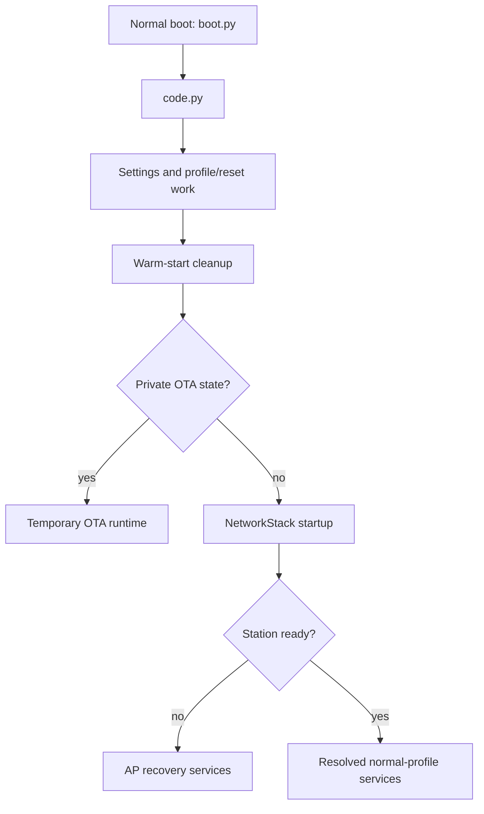

# Lesson 5: Startup and configuration

[Previous](04-deploy-and-first-observations.md) · [Index](README.md) · [Next](06-sensor-data-flow.md)

## What you will learn

Trace startup dependencies, explain live configuration versus templates, and
predict service selection for different profiles. Allow 90 minutes.

## Preparation and source map

Complete Lesson 4 or use a host checkout. No board writes are required. Read
[architecture](../architecture.md) and [configuration](../configuration.md).
Open [safemode.py](../../safemode.py), [boot.py](../../boot.py),
[code.py](../../code.py), [app.py](../../cpynodus_ii/app.py),
[settings.py](../../cpynodus_ii/core/settings.py), and
[config.py](../../cpynodus_ii/core/config.py). Locate `main`, `Settings`, and
`RuntimeConfig` with `rg -n` rather than relying on fixed line numbers.

## Walkthrough



`safemode.py` is a separate CircuitPython safe-mode entrypoint, not a normal
step between boot and the application. The normal path resolves configuration
before feature services use network resources. For MQTT profiles, broker
resolution and preflight precede normal MQTT ownership; broker-IP persistence
is attempted after successful connection when writable. NTP is attempted after
normal network setup without waiting for the startup MQTT queues to drain.

A normalized config object makes settings usable by services, but does not
mean every requested edit is durable. Live application, filesystem persistence,
and restart requirements are distinct parts of configuration handling.

## Lab

1. Copy the diagram into your report. Add source symbols for each box and
   identify the branch that avoids normal feature initialization in OTA mode.
2. Build a table for station `nodusweb`, station `sensorius`, and AP fallback.
   Predict whether each offers local setup, normal MQTT, and local automation.
3. Trace `[Profile].ACTIVE_PROFILE` from
   [the shared template](../../boards/settings.toml.def) through settings
   loading to service planning. Trace one sensor setting from its board template.
4. Locate a test for factory bootstrap and one for startup ordering:

   ```sh
   pytest tests/test_runtime_config.py tests/test_settings_bootstrap.py tests/test_app_startup.py
   ```

5. Explain each selected test's inputs, dependency doubles, and assertions.
   Describe an assertion that would fail if the relevant ordering changed.

## Acceptance and debugging

Submit the annotated graph, profile table, two test explanations, and actual
pytest result. Pass when every edge has an explained dependency and template
creation is distinguished from later live-file loading. This is a reading lab;
startup reordering is not an exercise requirement.

When docs appear inconsistent, use the current architecture/configuration
contract and inspect the implementation. Dated debug notes describe historical
investigations. Do not infer current policy from one old log.

## Reference answer and reflection

Station `nodusweb` has local setup and no MQTT; local automation additionally
requires an enabled switch. Station `sensorius` uses MQTT and has no normal
web UI or local automation. AP fallback offers provisioning and does not
represent normal MQTT operation. A changed template does not migrate existing
live configuration.

Why must socket users wait for resolved network state? Which settings need a
restart, and what evidence establishes that a saved value survived reboot?
