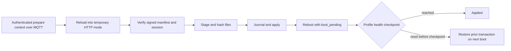

# Lesson 12: Signed OTA updates

[Previous](11-testing-and-observability.md) · [Index](README.md) · [Next](13-extension-project.md)

## What you will learn

Explain MQTT prepare versus HTTP transfer, audit an MPY-only package, and trace
transactional apply and boot-health rollback. Allow 120 minutes for host work;
reserve a separate supervised hardware session for transfer.

## Preparation

Read the current [OTA contract](../ota.md). Use a host checkout, pytest, and an
instructor-provided signed classroom package for the optional artifact audit.
Package building needs matching target compiler/dependencies, real Git refs,
and an instructor-controlled signing key. Hardware transfer additionally needs
a writable board, matching installed firmware, provisioned public key, classroom
broker, and a recovery plan. No deployment is performed by this document.

Inspect [nodus_ota.py](../../scripts/nodus_ota.py),
[nodus_mpy.sh](../../scripts/nodus_mpy.sh),
[OTA state](../../cpynodus_ii/ota/state.py),
[HTTP implementation](../../cpynodus_ii/ota/http.py),
[OTA runtime](../../cpynodus_ii/ota/runtime.py), and [code.py](../../code.py).

## Walkthrough



The signed manifest authenticates exact bytes and per-file hashes. Reformatting
it invalidates the signature. A file checksum alone does not establish who
approved an update. Temporary HTTP mode omits normal sensor/switch/MQTT service
startup to preserve resources. The private key stays off-device and out of Git.
For MQTT profiles, the firmware health checkpoint uses a successful client send
of the update result; validation still needs independent broker observations.

## Lab

1. Run the host cases that exercise package, authentication, transfer, and state:

   ```sh
   pytest tests/test_ota_state.py tests/test_ota_http.py tests/test_ota_package.py tests/test_ota_runtime.py tests/test_ota_auth.py
   ```

2. Select one invalid-signature case and one interrupted-apply recovery case.
   Explain setup, expected rejection/restoration, and what each test cannot
   establish about power loss on a physical filesystem.
3. Audit an instructor-provided package without modifying it. Record target,
   CircuitPython version, required installed version, files, deletions, preserved
   configs, signature presence, sizes, and hashes. Inspect the builder tests for
   how these fields are validated; signature presence alone is not verification.
4. Confirm all `cpynodus_ii/` payload modules are `.mpy`, each has a matching
   `.py` path in `delete`, and every expected artifact exists. Root entrypoints
   are included only when explicitly needed. Verify the package matches its
   selected board and compiled build metadata.
5. If building is assigned, first run `scripts/nodus_mpy.sh --target pico2w`
   with Lesson 4's compiler/library paths. Use the current tag-range command in the OTA
   contract with instructor-selected refs, compiled root, and signing key.
   Stop on compiler/tooling gaps; never substitute a source-module package.
6. Optional supervised transfer follows the OTA runbook. Capture prepare,
   temporary HTTP readiness, verification, commit, reboot, new retained firmware
   metadata, and resumed heartbeat. Fault injection stays in host tests unless
   the instructor has explicitly planned a disposable-board recovery exercise.

## Acceptance, hints, and reference answer

Submit host results, two failure-case explanations, and either a package audit
or a clearly marked audit of a test fixture. Report hardware stages unverified
when not performed. A compliant example pair is `cpynodus_ii/core/ntp.mpy` in
`files` and `cpynodus_ii/core/ntp.py` in `delete`; it is not a complete package.
A target mismatch, missing source deletion, changed signed manifest, or wrong
installed version should be rejected. An unsigned fallback is not a solution.

Why keep a transaction journal after copying succeeds? How does post-boot health
differ from successful file verification? What evidence separates an abandoned
transfer from a successfully applied update whose result was not observed?
